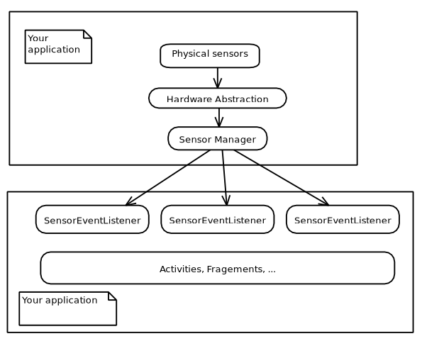
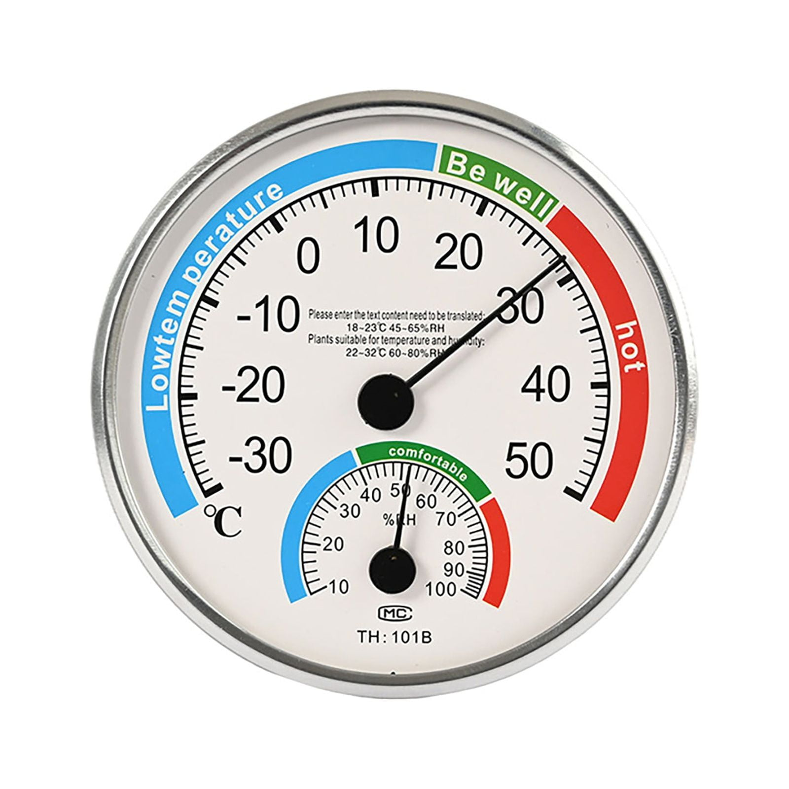

<!--
theme: gaia
size: 16:9
paginate: true
author: 'Sebastian Diaz, Raphaël Perret, Thomas Vuilleumier' 
title: 'Sensors on Android Devices'
description: 'Access and interpret sensor data'
url: 
footer: '**HEIG-VD** - DAA 2025 - 2026'
style: |
    :root {
        --color-background: #fff;
        --color-foreground: #333;
        --color-highlight: #f96;
        --color-dimmed: #888;
        --color-headings: #7d8ca3;
    }
    blockquote {
        font-style: italic;
    }
    table {
        height: 80%;
        width: 100%;
        font-size: 0.5rem;
    }
    h1, h2, h3, h4, h5, h6 {
        color: var(--color-headings);
    }
    h2, h3, h4, h5, h6 {
        font-size: 1.4rem;
    }
    h1 a:link, h2 a:link, h3 a:link, h4 a:link, h5 a:link, h6 a:link {
        text-decoration: none;
    }
    section:not([class=lead]) > p, blockquote {
        text-align: justify;
    }
headingDivider: 4
-->
# Accès aux capteurs Android
<!--
_class: lead
_paginate: false
-->

**Auteurs :** Sebastian Diaz, Raphaël Perret, Thomas Vuilleumier
**Groupe :** B11
**Cours :** DAA – Développement d'Applications Android
**Enseignant :** Fabien Dutoit
**Assistant :** Elliot Ganty
**Date :** Janvier 2026

## 1. Architecture et méthodologie d’accès



### Enregistrer un observateur

```kotlin
SensorManager manager = (SensorManager)getSystemService(SENSOR_SERVICE)
Sensor sensor = manager.getDefaultSensor(Sensor.TYPE_ACCELERATION_SENSOR);
SensorEventListener myEventListener;

// => max frequency = 100Hz
int samplingPeriodUs = 10000; // microseconds

// onResume
manager.registerListener(myEventListener,sensor,samplingPeriodUs)

// onPause
manager.unregisterListener(myEventListener)
```

### Traiter un évènement

```kotlin
public void onSensorChangeEvent(SensorEvent event){
    val x = event.values[0];
    // ...
}
```

`onSensorChangeEvent` est implémentée dans l’interface `SensorEventListener`.

## 2. Catégories de capteurs Android




- Mouvement
- Position
- Environnement

## 3. Capteurs de mouvement – étude approfondie


### Accéléromètre

Mesure l'accélération en m/s² sur les axes X,Y et Z.

La gravité est aussi mesurée et doit être filtrée.


### Exemple d’utilisation à l’accéléromètre :

```kotlin
public void onSensorChangeEvent(SensorEvent event){
    // ...
    // filtre
	final float alpha = 0.8;
	ygravity = alpha * ygravity + (1 - alpha) * event.values[1];
	
	// intégration
	val delta_time = event.timestamp - previous_sample_timestamp;
	yvelocity += delta_time * (event.values[1] - ygravity);
	//... 
}
```


### Gyroscope

- Vitesse angulaire en rad/s
- Vitesse angulaire intègrée dans le temps
- Imprécision cumulée (drift)

```kotlin
val gyroscope = sensorManager.getDefaultSensor(Sensor.TYPE_GYROSCOPE)
sensorManager.registerListener(this, gyroscope, SensorManager.SENSOR_DELAY_GAME)
```

### Capteurs de rotation (fusion)

- Capteur virtuel
- Combinaison de capteurs
- Données filtrées
- Pas besoin d'intégrer (donc pas de drift)
- A utiliser en priorité

```kotlin
val rotationVectorSensor = sensorManager.getDefaultSensor(Sensor.TYPE_ROTATION_VECTOR)
```

## 4. Capteurs de position


**Magnétomètre**
- Champ magnétique terrestre
- Détermine le nord magnétique
- Sensible aux intéreférences

## 5. Capteurs d’environnement


**En pratique**
- adaptation automatique de la luminosité de l’écran,
- estimation de l’altitude à partir de la pression atmosphérique,
- applications météo ou domotiques.

## 6. Bonnes pratiques et optimisation

- Garder une fréquence d'échantillonnage basse si possible
- Penser à désenregistrer les observateurs
- Lier au cycle de vie de l’activité
- Ajouter au manifest si capteur obligatoire

```xml
<uses-feature android:name="android.hardware.sensor.accelerometer"
               android:required="true"/>
```

## 7. Approche alternative

**Activity Recognition API**

Google fournit une API de reconnaissance d’activité de haut niveau.

```kotlin
val client = ActivityRecognition.getClient(context)
client.requestActivityUpdates(10_000, pendingIntent)
```

Cette approche permet d’identifier des activités telles que la marche, la course ou l’immobilité avec une consommation énergétique optimisée.

## 8. Questions

**Ressources utiles**

- [https://developer.android.com/develop/sensors-and-location/sensors/sensors_overview](https://developer.android.com/develop/sensors-and-location/sensors/sensors_overview)
- [https://developer.android.com/guide/topics/sensors/sensors_motion](https://developer.android.com/guide/topics/sensors/sensors_motion)
- [https://developer.android.com/guide/topics/sensors/sensors_position](https://developer.android.com/guide/topics/sensors/sensors_position)
- [https://developer.android.com/guide/topics/sensors/sensors_environment](https://developer.android.com/guide/topics/sensors/sensors_environment)
