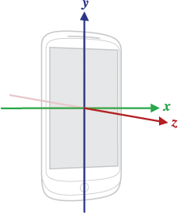

# Accès aux capteurs Android

## Accéléromètre, Gyroscope, Magnétomètre et autres

**Auteurs :** Sebastian Diaz, Raphaël Perret, Thomas Vuilleumier
**Groupe :** B11
**Cours :** DAA – Développement Android Avancé
**Enseignant :** Fabien Dutoit
**Assistant :** Elliot Ganty
**Date :** Janvier 2026

---

## Table des matières

1. [Introduction](#1-introduction)
2. [Architecture et méthodologie d’accès](#2-architecture-et-méthodologie-daccès)
3. [Catégories de capteurs Android](#3-catégories-de-capteurs-android)
4. [Choisir le bon capteur selon le besoin](#4-choisir-le-bon-capteur-selon-le-besoin)
5. [Capteurs de mouvement (étude approfondie)](#5-capteurs-de-mouvement-étude-approfondie)
6. [Capteurs de position](#6-capteurs-de-position)
7. [Capteurs d’environnement](#7-capteurs-denvironnement)
8. [Bonnes pratiques et optimisation](#8-bonnes-pratiques-et-optimisation)
9. [Limitations et points d’attention](#9-limitations-et-points-dattention)
10. [Approches alternatives](#10-approches-alternatives)
11. [Périmètre du travail](#11-périmètre-du-travail)
12. [Conclusion](#12-conclusion)

---

<div class="page"/>

## 1. Introduction

Les appareils Android modernes intègrent de nombreux capteurs physiques permettant aux applications d’interagir avec le monde réel. Ces capteurs transforment des phénomènes physiques (accélération, rotation, champ magnétique, lumière, pression, etc.) en données numériques exploitables par les applications.

L’accès aux capteurs est une fonctionnalité avancée de l’écosystème Android, car elle implique des contraintes fortes en matière de performance, de consommation énergétique, de précision des données et de compatibilité matérielle.

### Problématiques adressées

L’utilisation des capteurs permet notamment de :

* déterminer l’orientation et le mouvement d’un appareil,
* enrichir l’expérience utilisateur dans les jeux et applications interactives,
* suivre l’activité physique de l’utilisateur,
* adapter dynamiquement l’interface ou le comportement d’une application,
* implémenter des fonctionnalités sensibles au contexte.

---

## 2. Architecture et méthodologie d’accès

L’accès aux capteurs Android repose sur une architecture événementielle fournie par le système.

Une application ne lit jamais directement un capteur matériel. Elle communique avec le service système `SensorManager`, qui agit comme intermédiaire entre le matériel et l’application.

Chaîne simplifiée :

```
Application
  ↓
SensorEventListener
  ↓
SensorManager (service système)
  ↓
HAL (Hardware Abstraction Layer)
  ↓
Capteur physique
```

L’application s’enregistre comme observateur et reçoit des événements lorsque de nouvelles mesures sont disponibles.

Un point essentiel est la gestion du cycle de vie : un capteur ne doit être actif que lorsque l’application en a réellement besoin.

---

<div class="page"/>

## 3. Catégories de capteurs Android

Android regroupe les capteurs en trois grandes catégories.

### Capteurs de mouvement

Ils mesurent les accélérations et rotations sur les trois axes de l’espace.

Exemples : accéléromètre, gyroscope, capteur de gravité, vecteur de rotation.

### Capteurs de position

Ils permettent de déterminer l’orientation ou la position relative de l’appareil.

Exemples : magnétomètre, capteur de proximité.

### Capteurs d’environnement

Ils mesurent les caractéristiques de l’environnement physique.

Exemples : luminosité, pression atmosphérique, température, humidité.

---

## 4. Choisir le bon capteur selon le besoin

Un même objectif peut souvent être atteint avec plusieurs capteurs. Le choix du capteur dépend principalement de la précision attendue, de la consommation énergétique et de la disponibilité matérielle.

| Objectif                    | Capteur recommandé       | Justification                                  |
| --------------------------- | ------------------------ | ---------------------------------------------- |
| Détecter une inclinaison    | Accéléromètre            | Simple, présent sur presque tous les appareils |
| Orientation stable          | Vecteur de rotation      | Fusion de capteurs, pas de dérive              |
| Jeux sans référence au nord | Game Rotation Vector     | Évite les interférences magnétiques            |
| Détection de secousse       | Accélération linéaire    | Gravité exclue                                 |
| Compteur de pas             | Step Counter             | Très faible consommation                       |
| Reconnaissance d’activité   | Activity Recognition API | Algorithmes optimisés côté système             |

Cette étape de sélection est cruciale pour éviter une implémentation inutilement complexe ou énergivore.

---

<div class="page"/>

## 5. Capteurs de mouvement – étude approfondie

### Accéléromètre

L’accéléromètre mesure l’accélération appliquée à l’appareil sur les axes X, Y et Z, en incluant la gravité.



Exemple d’accès à l’accéléromètre :

```kotlin
val sensorManager = getSystemService(Context.SENSOR_SERVICE) as SensorManager
val accelerometer = sensorManager.getDefaultSensor(Sensor.TYPE_ACCELEROMETER)

sensorManager.registerListener(this, accelerometer, SensorManager.SENSOR_DELAY_UI)
```

Dans `onSensorChanged`, les valeurs correspondent aux axes X, Y et Z :

```kotlin
override fun onSensorChanged(event: SensorEvent) {
    val x = event.values[0]
    val y = event.values[1]
    val z = event.values[2]
}
```

L’accéléromètre est couramment utilisé pour détecter des secousses, mesurer une inclinaison ou servir de base à la fusion de capteurs.

### Capteurs de rotation (fusion)

Android fournit des capteurs virtuels basés sur la fusion de plusieurs capteurs physiques.

```kotlin
val rotationVector = sensorManager.getDefaultSensor(Sensor.TYPE_ROTATION_VECTOR)
```

Ces capteurs offrent une orientation stable et sont recommandés dans la majorité des cas.

<div class="page"/>

### Gyroscope

Le gyroscope mesure la vitesse angulaire autour des trois axes (en rad/s). Il est très précis pour détecter les rotations rapides.

```kotlin
val gyroscope = sensorManager.getDefaultSensor(Sensor.TYPE_GYROSCOPE)
sensorManager.registerListener(this, gyroscope, SensorManager.SENSOR_DELAY_GAME)
```

Pour obtenir un angle de rotation, la vitesse angulaire doit être intégrée dans le temps, ce qui entraîne une dérive progressive (drift).

---

## 6. Capteurs de position

### Magnétomètre

Le magnétomètre mesure le champ magnétique ambiant. Il est principalement utilisé pour déterminer la direction du nord magnétique.

Il est très sensible aux interférences (objets métalliques, champs électriques), ce qui nécessite souvent une calibration.

### Capteur de proximité

Le capteur de proximité détecte la présence d’un objet proche de l’appareil. Il est couramment utilisé pour éteindre l’écran lors des appels téléphoniques.

---

## 7. Capteurs d’environnement

Les capteurs d’environnement fournissent des informations sur le contexte physique.

Exemples d’utilisation :

* adaptation automatique de la luminosité de l’écran,
* estimation de l’altitude à partir de la pression atmosphérique,
* applications météo ou domotiques.

Tous les appareils ne disposent pas de ces capteurs.

---

<div class="page"/>

## 8. Bonnes pratiques et optimisation

L’utilisation des capteurs doit toujours être raisonnée.

Principes essentiels :

* enregistrer les capteurs uniquement lorsque nécessaire,
* adapter la fréquence d’échantillonnage au besoin réel,
* filtrer les données bruitées,
* privilégier les capteurs de haut niveau lorsque possible,
* tester sur des appareils réels.

Les capteurs figurent parmi les composants les plus consommateurs d’énergie sur un appareil mobile.

---

## 9. Limitations et points d’attention

### Fragmentation matérielle

Tous les appareils Android ne disposent pas des mêmes capteurs. Une application doit prévoir des mécanismes de dégradation progressive.

### Bruit et précision

Les mesures issues des capteurs sont imparfaites : bruit, biais, dérive et latence sont des phénomènes courants.

### Erreurs fréquentes

* utiliser une fréquence maximale sans justification,
* oublier de désenregistrer les listeners,
* confondre inclinaison et accélération,
* intégrer un gyroscope sans correction,
* se limiter aux tests sur émulateur.

---

## 10. Approches alternatives

### Activity Recognition API

Google fournit une API de reconnaissance d’activité de haut niveau.

```kotlin
val client = ActivityRecognition.getClient(context)
client.requestActivityUpdates(10_000, pendingIntent)
```

Cette approche permet d’identifier des activités telles que la marche, la course ou l’immobilité avec une consommation énergétique optimisée.

<div class="page"/>

### Ressources utiles

* [https://developer.android.com/develop/sensors-and-location/sensors/sensors_overview](https://developer.android.com/develop/sensors-and-location/sensors/sensors_overview)
* [https://developer.android.com/guide/topics/sensors/sensors_motion](https://developer.android.com/guide/topics/sensors/sensors_motion)
* [https://developer.android.com/guide/topics/sensors/sensors_position](https://developer.android.com/guide/topics/sensors/sensors_position)
* [https://developer.android.com/guide/topics/sensors/sensors_environment](https://developer.android.com/guide/topics/sensors/sensors_environment)

---

## 11. Périmètre du travail

Ce document couvre :

* l’accès aux capteurs via l’API Android SensorManager,
* les principaux capteurs de mouvement, position et environnement,
* les bonnes pratiques, limitations et alternatives.

Ne sont pas traités en détail :

* les filtres avancés (Kalman, SLAM),
* la réalité augmentée via ARCore,
* les algorithmes temps réel complexes en NDK.

---

## 12. Conclusion

L’accès aux capteurs Android permet de créer des applications riches, contextuelles et interactives. Cette puissance implique toutefois une gestion rigoureuse du cycle de vie, de la consommation énergétique et de la qualité des données.

Une bonne compréhension des capteurs, de leurs limites et des alternatives disponibles est indispensable pour concevoir des applications robustes et performantes.

---

## Annexe – Utilisation d’IA générative

Dans le cadre de ce travail, des outils d’IA générative ont été utilisés pour :

* reformuler certaines explications techniques,
* vérifier la cohérence de la structure,
* proposer des exemples pédagogiques.

L’ensemble du contenu technique repose sur l’étude de la documentation officielle Android et sur des connaissances acquises durant le cours.
